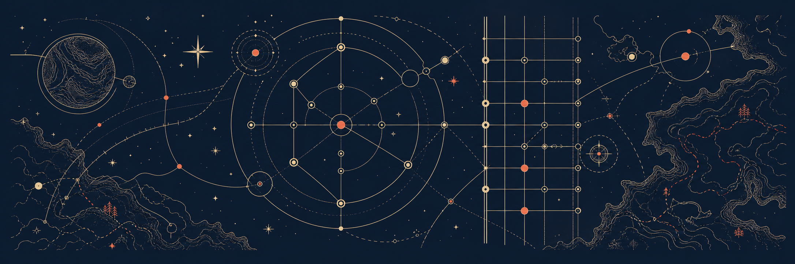

<h1 align="center">Vinicius Scherer de Oliveira</h1>

  Software engineer building local-first AI systems, deterministic simulations, 
  and creative tools for music and fictional worlds.

  <a href="https://www.linkedin.com/in/viniciusschererdeoliveira">LinkedIn</a>
  &nbsp;·&nbsp;
  <a href="mailto:contact@vscherer.me">contact@vscherer.me</a>

## About

I am a Software Engineer at **CWI Software** with experience across mobile, web, and backend development. My current work involves Flutter, React, and NestJS in a mix of new product development and gradual legacy modernization. Outside my day job, I explore the boundary between dependable software engineering and applied AI: systems where model behavior is observable, world state is reproducible, and creative tools remain useful without hiding their decisions.

My independent work brings together AI experimentation, simulation, music, and worldbuilding.

## Current work

| Project | What I am exploring | Stage |
| --- | --- | --- |
| **Asterism Polyphony** | A reproducible atlas of playable all-fourths guitar voicings, with explicit constraints and explainable ranking. | Preparing a public release |
| **Project UtopiA** | A multi-agent fictional-world simulation where deterministic mechanics own state and language models provide cognition and narrative. | Active development |
| **Asterism J-Lens** | Projected-Jacobian experiments for making language-model behavior cheaper to inspect and compare. | Active research |
| **Alice** | A local-first personal AI system that brings tools, context, and multimodal interaction into one maintainable architecture. | Consolidating foundations |

Projects become links here only when their code, documentation, and provenance are ready to represent the work publicly.

## How I build

- **Local-first when practical.** Core workflows should remain inspectable, portable, and useful without depending on a hosted black box.
- **Deterministic at the core.** Models may interpret and advise; explicit systems own state, policy, and replay.
- **Evidence before claims.** Benchmarks, artifacts, and failure cases matter more than impressive-sounding numbers.
- **Documentation as part of the system.** Architecture, operational boundaries, and validation paths evolve with the code.

## Toolbox

- **Languages:** TypeScript, JavaScript, Go, Python
- **Interfaces and services:** React, React Native, NestJS, Flutter
- **AI and systems:** model evaluation, agent orchestration, classical ML, local inference experiments

When I am away from code, I am usually playing guitar, listening to J-Pop or metalcore, or designing fictional worlds and their underlying systems.

---

  <a href="mailto:contact@vscherer.me">contact@vscherer.me</a>

